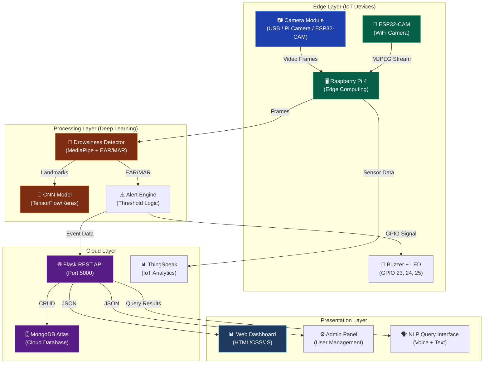
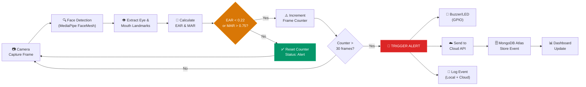
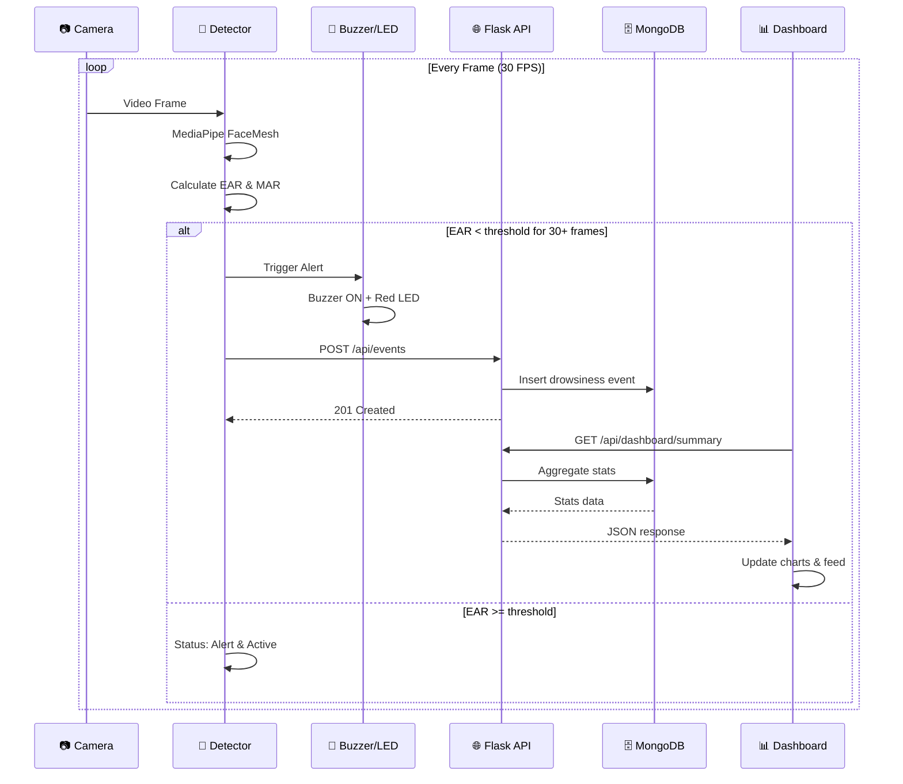

# System Architecture & Data Flow Diagrams

## 1. System Architecture Diagram

```mermaid
graph TB
    subgraph "Edge Layer (IoT Devices)"
        CAM["📷 Camera Module<br/>(USB / Pi Camera / ESP32-CAM)"]
        RPI["🖥️ Raspberry Pi 4<br/>(Edge Computing)"]
        ESP["📡 ESP32-CAM<br/>(WiFi Camera)"]
        BUZ["🔔 Buzzer + LED<br/>(GPIO 23, 24, 25)"]
    end

    subgraph "Processing Layer (Deep Learning)"
        DET["🧠 Drowsiness Detector<br/>(MediaPipe + EAR/MAR)"]
        CNN["🤖 CNN Model<br/>(TensorFlow/Keras)"]
        ALERT["⚠️ Alert Engine<br/>(Threshold Logic)"]
    end

    subgraph "Cloud Layer"
        API["🌐 Flask REST API<br/>(Port 5000)"]
        DB["🗄️ MongoDB Atlas<br/>(Cloud Database)"]
        TS["📊 ThingSpeak<br/>(IoT Analytics)"]
    end

    subgraph "Presentation Layer"
        DASH["📊 Web Dashboard<br/>(HTML/CSS/JS)"]
        ADMIN["⚙️ Admin Panel<br/>(User Management)"]
        NLP["🗣️ NLP Query Interface<br/>(Voice + Text)"]
    end

    CAM -->|"Video Frames"| RPI
    ESP -->|"MJPEG Stream"| RPI
    RPI -->|"Frames"| DET
    DET -->|"Landmarks"| CNN
    DET -->|"EAR/MAR"| ALERT
    ALERT -->|"GPIO Signal"| BUZ
    ALERT -->|"Event Data"| API
    RPI -->|"Sensor Data"| TS
    API -->|"CRUD"| DB
    API -->|"JSON"| DASH
    API -->|"JSON"| ADMIN
    API -->|"Query Results"| NLP

    style CAM fill:#1e40af,stroke:#3b82f6,color:#fff
    style RPI fill:#065f46,stroke:#10b981,color:#fff
    style ESP fill:#065f46,stroke:#10b981,color:#fff
    style DET fill:#7c2d12,stroke:#f97316,color:#fff
    style CNN fill:#7c2d12,stroke:#f97316,color:#fff
    style API fill:#581c87,stroke:#a855f7,color:#fff
    style DB fill:#581c87,stroke:#a855f7,color:#fff
    style DASH fill:#1e3a5f,stroke:#38bdf8,color:#fff
```

## 2. Data Flow Diagram

```mermaid
flowchart LR
    A["📷 Camera<br/>Capture Frame"] --> B["🔍 Face Detection<br/>(MediaPipe FaceMesh)"]
    B --> C["👁️ Extract Eye &<br/>Mouth Landmarks"]
    C --> D["📐 Calculate<br/>EAR & MAR"]
    D --> E{EAR < 0.22<br/>or MAR > 0.75?}
    E -->|Yes| F["⚠️ Increment<br/>Frame Counter"]
    E -->|No| G["✅ Reset Counter<br/>Status: Alert"]
    F --> H{Counter ><br/>30 frames?}
    H -->|Yes| I["🚨 TRIGGER ALERT"]
    H -->|No| A
    G --> A
    I --> J["🔔 Buzzer/LED<br/>(GPIO)"]
    I --> K["☁️ Send to<br/>Cloud API"]
    I --> L["📝 Log Event<br/>(Local + Cloud)"]
    K --> M["🗄️ MongoDB Atlas<br/>Store Event"]
    M --> N["📊 Dashboard<br/>Update"]

    style I fill:#dc2626,stroke:#ef4444,color:#fff
    style E fill:#d97706,stroke:#f59e0b,color:#fff
    style G fill:#059669,stroke:#10b981,color:#fff
```

## 3. Sequence Diagram

```mermaid
sequenceDiagram
    participant Cam as 📷 Camera
    participant Det as 🧠 Detector
    participant GPIO as 🔔 Buzzer/LED
    participant API as 🌐 Flask API
    participant DB as 🗄️ MongoDB
    participant Dash as 📊 Dashboard

    loop Every Frame (30 FPS)
        Cam->>Det: Video Frame
        Det->>Det: MediaPipe FaceMesh
        Det->>Det: Calculate EAR & MAR

        alt EAR < threshold for 30+ frames
            Det->>GPIO: Trigger Alert
            GPIO->>GPIO: Buzzer ON + Red LED
            Det->>API: POST /api/events
            API->>DB: Insert drowsiness event
            API-->>Det: 201 Created
            Dash->>API: GET /api/dashboard/summary
            API->>DB: Aggregate stats
            DB-->>API: Stats data
            API-->>Dash: JSON response
            Dash->>Dash: Update charts & feed
        else EAR >= threshold
            Det->>Det: Status: Alert & Active
        end
    end
```
