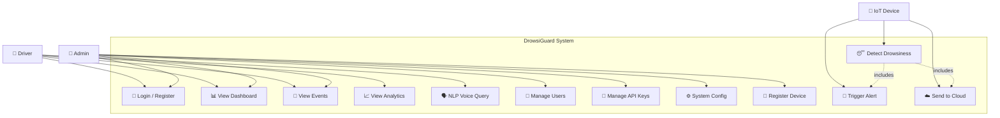
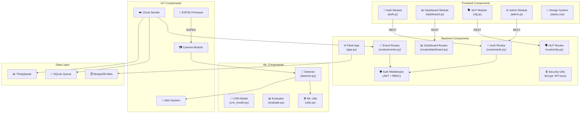
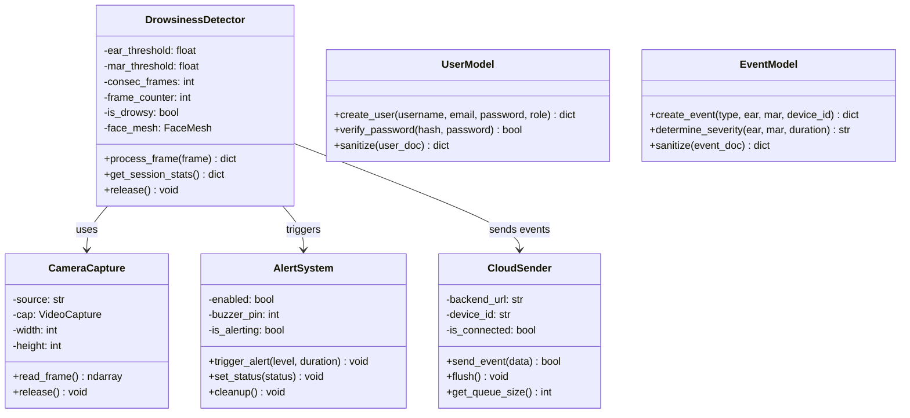
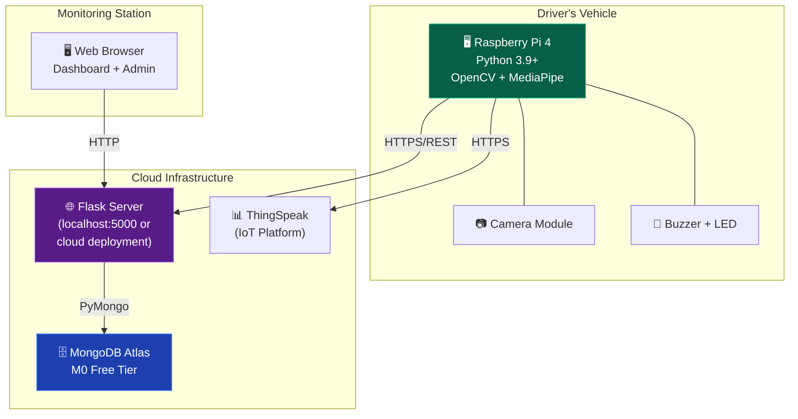

# UML Diagrams

## 1. Use Case Diagram

```mermaid
graph TB
    subgraph "DrowsiGuard System"
        UC1["🔐 Login / Register"]
        UC2["📊 View Dashboard"]
        UC3["🔔 View Events"]
        UC4["📈 View Analytics"]
        UC5["🗣️ NLP Voice Query"]
        UC6["👥 Manage Users"]
        UC7["🔑 Manage API Keys"]
        UC8["⚙️ System Config"]
        UC9["📡 Register Device"]
        UC10["😴 Detect Drowsiness"]
        UC11["🔔 Trigger Alert"]
        UC12["☁️ Send to Cloud"]
    end

    Driver["👤 Driver"]
    Admin["👑 Admin"]
    IoT["📡 IoT Device"]

    Driver --> UC1
    Driver --> UC2
    Driver --> UC3
    Driver --> UC4
    Driver --> UC5

    Admin --> UC1
    Admin --> UC2
    Admin --> UC3
    Admin --> UC6
    Admin --> UC7
    Admin --> UC8
    Admin --> UC9

    IoT --> UC10
    IoT --> UC11
    IoT --> UC12

    UC10 -.->|"includes"| UC11
    UC10 -.->|"includes"| UC12
```

## 2. Component Diagram

```mermaid
graph TB
    subgraph "Frontend Components"
        FE1["🔐 Auth Module<br/>(auth.js)"]
        FE2["📊 Dashboard Module<br/>(dashboard.js)"]
        FE3["🗣️ NLP Module<br/>(nlp.js)"]
        FE4["⚙️ Admin Module<br/>(admin.js)"]
        FE5["🎨 Design System<br/>(styles.css)"]
    end

    subgraph "Backend Components"
        BE1["🌐 Flask App<br/>(app.py)"]
        BE2["🔐 Auth Routes<br/>(routes/auth.py)"]
        BE3["🔔 Event Routes<br/>(routes/events.py)"]
        BE4["📊 Dashboard Routes<br/>(routes/dashboard.py)"]
        BE5["🗣️ NLP Routes<br/>(routes/nlp.py)"]
        BE6["🛡️ Auth Middleware<br/>(JWT + RBAC)"]
        BE7["🔒 Security Utils<br/>(bcrypt, API keys)"]
    end

    subgraph "ML Components"
        ML1["🧠 Detector<br/>(detector.py)"]
        ML2["🤖 CNN Model<br/>(cnn_model.py)"]
        ML3["📊 Evaluator<br/>(evaluate.py)"]
        ML4["🛠️ ML Utils<br/>(utils.py)"]
    end

    subgraph "IoT Components"
        IOT1["📷 Camera Module"]
        IOT2["🔔 Alert System"]
        IOT3["☁️ Cloud Sender"]
        IOT4["📡 ESP32 Firmware"]
    end

    subgraph "Data Layer"
        DB1["🗄️ MongoDB Atlas"]
        DB2["📊 ThingSpeak"]
        DB3["💾 SQLite Queue"]
    end

    FE1 -->|"REST"| BE2
    FE2 -->|"REST"| BE4
    FE3 -->|"REST"| BE5
    FE4 -->|"REST"| BE2

    BE2 --> BE6
    BE3 --> BE6
    BE1 --> DB1
    IOT3 --> BE3
    IOT3 --> DB3
    IOT1 --> ML1
    ML1 --> ML4
    ML1 --> IOT2
    IOT4 -->|"MJPEG"| IOT1
    IOT3 --> DB2
```

## 3. Class Diagram

```mermaid
classDiagram
    class DrowsinessDetector {
        -ear_threshold: float
        -mar_threshold: float
        -consec_frames: int
        -frame_counter: int
        -is_drowsy: bool
        -face_mesh: FaceMesh
        +process_frame(frame) dict
        +get_session_stats() dict
        +release() void
    }

    class CameraCapture {
        -source: str
        -cap: VideoCapture
        -width: int
        -height: int
        +read_frame() ndarray
        +release() void
    }

    class AlertSystem {
        -enabled: bool
        -buzzer_pin: int
        -is_alerting: bool
        +trigger_alert(level, duration) void
        +set_status(status) void
        +cleanup() void
    }

    class CloudSender {
        -backend_url: str
        -device_id: str
        -is_connected: bool
        +send_event(data) bool
        +flush() void
        +get_queue_size() int
    }

    class UserModel {
        +create_user(username, email, password, role) dict
        +verify_password(hash, password) bool
        +sanitize(user_doc) dict
    }

    class EventModel {
        +create_event(type, ear, mar, device_id) dict
        +determine_severity(ear, mar, duration) str
        +sanitize(event_doc) dict
    }

    DrowsinessDetector --> CameraCapture : uses
    DrowsinessDetector --> AlertSystem : triggers
    DrowsinessDetector --> CloudSender : sends events
```

## 4. Deployment Diagram

```mermaid
graph TB
    subgraph "Driver's Vehicle"
        RPI["🖥️ Raspberry Pi 4<br/>Python 3.9+<br/>OpenCV + MediaPipe"]
        CAM["📷 Camera Module"]
        BUZ["🔔 Buzzer + LED"]
        RPI --- CAM
        RPI --- BUZ
    end

    subgraph "Cloud Infrastructure"
        ATLAS["🗄️ MongoDB Atlas<br/>M0 Free Tier"]
        FLASK["🌐 Flask Server<br/>(localhost:5000 or<br/>cloud deployment)"]
        SPEAK["📊 ThingSpeak<br/>(IoT Platform)"]
    end

    subgraph "Monitoring Station"
        BROWSER["🖥️ Web Browser<br/>Dashboard + Admin"]
    end

    RPI -->|"HTTPS/REST"| FLASK
    RPI -->|"HTTPS"| SPEAK
    FLASK -->|"PyMongo"| ATLAS
    BROWSER -->|"HTTP"| FLASK

    style RPI fill:#065f46,stroke:#10b981,color:#fff
    style FLASK fill:#581c87,stroke:#a855f7,color:#fff
    style ATLAS fill:#1e40af,stroke:#3b82f6,color:#fff
```
